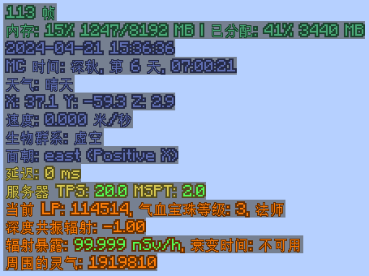

[English](./README_EN.md)

# MiniHUD Extra

  
  
  
  

### 概述
本模组为 [MiniHUD](https://www.curseforge.com/minecraft/mc-mods/minihud) (Fabric) 或 [BoccHUD](https://modrinth.com/mod/bocchud) (Forge) 添加了一些功能。 
在游戏中按下 Z + C 打开模组配置。

### 功能
#### 样式相关
- 修改颜色：为 MiniHUD 的每一行文本都添加可配置的颜色，而不是整个 HUD 的文本都只能是一种颜色。
- 文本描边：为文本添加描边，即荧光墨囊作用在告示牌文本上的效果。
- [FTB Ultimine](https://www.curseforge.com/minecraft/mc-mods/ftb-ultimine-fabric) 支持：当 FTB Ultimine 激活时，自动禁用 MiniHUD，防止两个 HUD 的重叠。如果你和我一样只习惯 HUD 在左上角的话。
- MiniHUD 支持翻译：为 MiniHUD 显示的文本添加本地化支持。仅限 Forge，Fabric 请使用 [Masa Gadget](https://modrinth.com/mod/masa-gadget/)。
#### 新增信息
- 月相显示：显示当前月相。仅限 1.18.2，1.18.2+ MiniHUD 已自带月相显示。
- 天气显示：显示当前天气。
- 模组联动（需要服务端加载）
    - [Blood Magic 3（血魔法 3）](https://www.curseforge.com/minecraft/mc-mods/blood-magic)：显示玩家灵魂网络中的 LP 和气血宝珠等级。
    - [Deep Resonance（深度共振）](https://www.curseforge.com/minecraft/mc-mods/deep-resonance)：显示玩家周围的辐射值。
    - [Mekanism（通用机械）](https://www.curseforge.com/minecraft/mc-mods/mekanism)：显示玩家的辐射暴露。
    - [Nature's Aura（自然灵气）](https://www.curseforge.com/minecraft/mc-mods/natures-aura)：显示玩家周围的灵气值。
    - [Serene Seasons（静谧四季）](https://www.curseforge.com/minecraft/mc-mods/serene-seasons)：显示当前季节的信息。

### 已知问题
- 配置菜单中，配置项的 tooltip 如果包含类似 `%d` 这样的格式化说明符，会导致格式化错误。

### 画廊

### 编译
- 克隆本仓库。
- 打开命令行并定位到仓库目录。
- 运行 `gradlew build` 来编译模组。
- 编译好的模组生成在 `forge/build/libs`、`fabric/build/libs` 和 `neoforge/build/libs`。