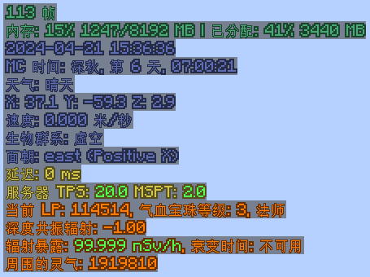
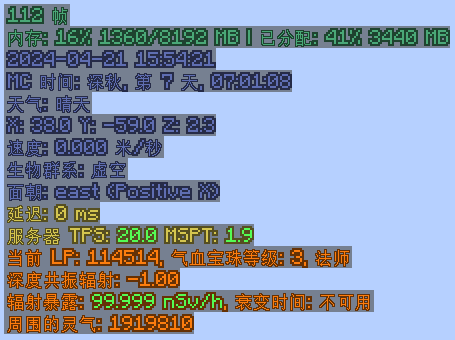

[简体中文](./README.md)

# MiniHUD Extra

  
  
  

### Overview
This mod adds some features to [MiniHUD](https://www.curseforge.com/minecraft/mc-mods/minihud) (Fabric) or [BoccHUD](https://modrinth.com/mod/bocchud) (Forge). 
Press Z + C in the game to open the config GUI.

### Features
#### Style-related
- Modify Colors: Add configurable colors to each line of text in the MiniHUD, instead of just one color for the entire HUD's text.
- Text Outline: Add outline to the text, which is the glow ink sac effect to the sign text.
- [FTB Ultimine](https://www.curseforge.com/minecraft/mc-mods/ftb-ultimine-fabric) Supoort: Automatically disables MiniHUD when FTB Ultimine is active, preventing the overlap between the two HUDs. If you're like me, only used to the HUD being in the top left corner...
- MiniHUD I18n: Add i18n support for text displayed by MiniHUD. Forge only, for Fabric, use [Masa Gadget](https://modrinth.com/mod/masa-gadget/) instead.
#### New info
- Show Moon Phase: Show the moon phase. 1.18.2 only, 1.18.2+ MiniHUD has built-in moon phase display.
- Show Weather: Show the weather.
- Mod Integration (Requires server side to load)
    - [Blood Magic 3](https://www.curseforge.com/minecraft/mc-mods/blood-magic): Show the LP and blood orb tier in player's soul network.
    - [Deep Resonance](https://www.curseforge.com/minecraft/mc-mods/deep-resonance): Show radiation value around player.
    - [Mekanism](https://www.curseforge.com/minecraft/mc-mods/mekanism): Show player's radiation exposure.
    - [Nature's Aura](https://www.curseforge.com/minecraft/mc-mods/natures-aura): Show aura value around player.
    - [Serene Seasons）](https://www.curseforge.com/minecraft/mc-mods/serene-seasons): Show the current season info.

### Known issues
- In the config menu, if the tooltip of a config item contains a format specifier like `%d`, it will cause a format error.

### Gallery

### Compiling
- Clone the repository.
- Open a command prompt/terminal to the repository directory.
- Run `gradlew build` to build the mod.
- The built jar file will be in `forge/build/libs` and `fabric/build/libs`.